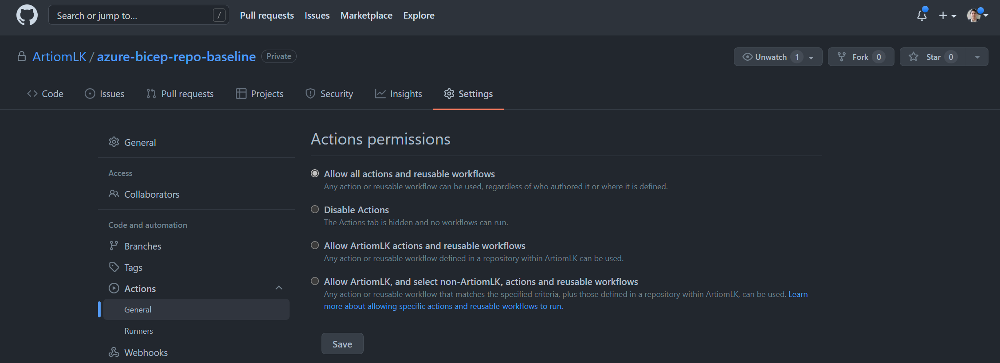
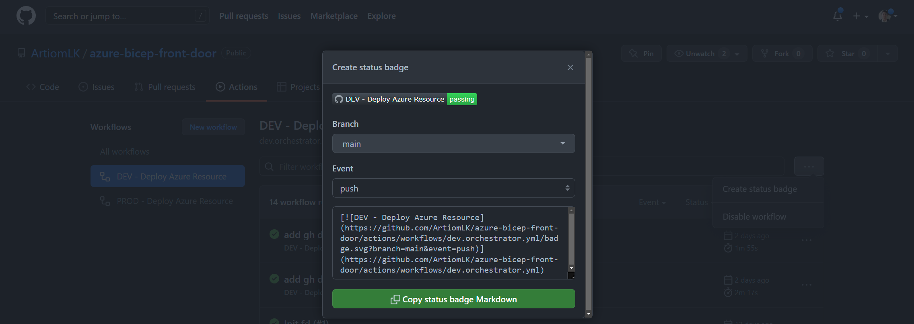
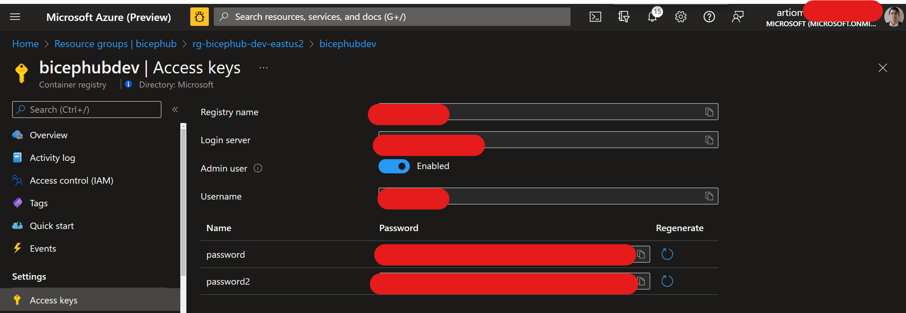
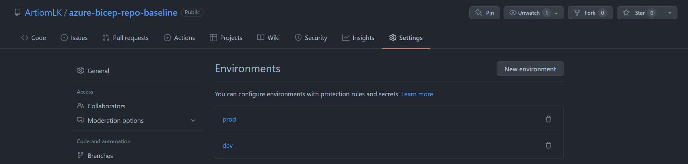

# Azure

[](https://github.com/ArtiomLK/azure-bicep-front-door/actions/workflows/dev.orchestrator.yml)

## Instructions



</br>



</br>



</br>

```bash
# Create an Azure resource group where the resources will be deployed

# ---
# Main Vars
# ---
repo_n="azure-bicep-repo-baseline";          echo $repo_n
project="bicephub";                          echo $project
env="prod";                                  echo $env
app_rg="rg-$repo_n";                         echo $repo_n
l="eastus2";                                 echo $l
tags="env=$env project=$project";            echo $tags

az group create \
--name $app_rg \
--location $l \
--tags $tags
```

```yaml
Create an Azure App Registration if you don't have one
Create an Azure App Registration Secret to be used in the GH Environment AZURE_CREDENTIALS secret
Assign the Azure App Registration contributor RBAC to the RG

Create the Following Secrets per GH Environment
ACR_LOGIN_SERVER : "Value from ACR Login Server"
ACR_PASSWORD : "Value from ACR password"
ACR_USERNAME : "Value from ACR Username"
AZURE_CREDENTIALS :
{
  "clientId": "XXXXXXXX",
  "clientSecret": "XXXXXXXX",
  "subscriptionId": "XXXXXXXX",
  "tenantId": "XXXXXXXX"
}
```



</br>

```yaml
Update .github workflow environment/env
Update main.bicep
Update examples.bicep
Update README params and local deployment instructions and remove unnecessary instructions
```

## Parameter Values

| Name | Description       | Value  | Examples         |
| ---- | ----------------- | ------ | ---------------- |
| tags | Az Resources tags | object | `{ key: value }` |

### [Reference Examples][1]

## Locally test Azure Bicep Modules

```bash
# Create an Azure Resource Group
az group create \
--name 'rg-azure-bicep-resource' \
--location 'eastus2' \
--tags project=bicephub env=dev

# Deploy Sample Modules
az deployment group create \
--resource-group 'rg-azure-bicep-resource' \
--mode Complete \
--template-file examples/examples.bicep
```

[1]: ./examples/examples.bicep
